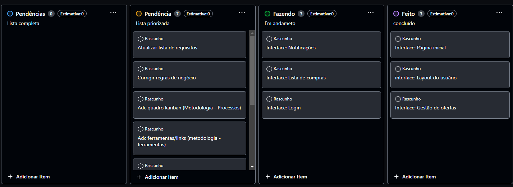

# Metodologia

Esta seção descreve a organização da equipe para a execução das tarefas do projeto e as ferramentas utilizadas para a manutenção dos códigos e demais artefatos.

## Gerenciamento de Projeto
A metodologia ágil escolhida para o desenvolvimento deste projeto foi o SCRUM, pois como citam Amaral, Fleury e Isoni (2019, p. 68), seus benefícios são a

“visão clara dos resultados a entregar; ritmo e disciplina necessários à execução; definição de papéis e responsabilidades dos integrantes do projeto (Scrum Owner, Scrum Master e Team); empoderamento dos membros da equipe de projetos para atingir o desafio; conhecimento distribuído e compartilhado de forma colaborativa; ambiência favorável para crítica às ideias e não às pessoas.”

### Divisão de Papéis

A equipe utiliza o Scrum como base para definição do processo de desenvolvimento.
[Adicione informações abaixo sobre a divisão de papéis entre os membros da equipe.]
- Scrum Master: Patrick Breno.
- Product Owner: Tobias Quintão.
- Equipe de Desenvolvimento: Patrick Breno, Tobias Quintão, Isac Alves, Lorrayne santos, Caroline Lourenço, Davi Lucca.
- Equipe de Design: Isac Alves.

### Processo

o quadro kanban atualizado se encontra no link a seguir -> [kanban](https://github.com/ICEI-PUC-Minas-PMV-ADS/pmv-ads-2024-1-e1-proj-web-t7-projeto-supermercado/assets/91565261/f1bb22c9-45f9-4adb-8087-d6a5d6da9b91)

### Etiquetas

As tarefas são, ainda, etiquetadas em função da natureza da atividade e seguem o seguinte esquema de cores/categorias:

<ul>
  <li>Bug (Erro no código)</li>
  <li>Desenvolvimento (Development)</li>
  <li>Documentação (Documentation)</li>
  <li>Gerência de Projetos (Project Management)</li>
  <li>Infraestrutura (Infrastructure)</li>
  <li>Testes (Tests)</li>
</ul>

<figure> 
  Figura 3 - Tela do esquema de cores e categorias</figcaption>
</figure> 
  
### Ferramentas

[Descreva aqui as ferramentas empregadas no projeto e os ambiente de trabalho utilizados pela  equipe para desenvolvê-lo. Abrange a relação de ambientes utilizados, a estrutura para gestão do código fonte, além da definição do processo e ferramenta através dos quais a equipe se organiza (Gestão de Times).]

Os artefatos do projeto são desenvolvidos a partir de diversas plataformas e a relação dos ambientes com seu respectivo propósito é apresentada na tabela que se segue.

| AMBIENTE                            | PLATAFORMA                         | LINK DE ACESSO                         |
|-------------------------------------|------------------------------------|----------------------------------------|
| Repositório de código fonte         | GitHub                             | http://....                            |
| Documentos do projeto               | GitHub                             | http://....                            |
| Projeto de Interface                | Figma                              | http://....                            |
| Gerenciamento do Projeto            | GitHub Projects                    | http://....                            |
| Hospedagem                          | GitHub Pages                       | http://....                            |

### Estratégia de Organização de Codificação 

Todos os artefatos relacionados a implementação e visualização dos conteúdos do projeto do site deverão ser inseridos na pasta [codigo-fonte](http://https://github.com/ICEI-PUC-Minas-PMV-ADS/WebApplicationProject-Template-v2/tree/main/codigo-fonte). Consulte também a nossa sugestão referente a estratégia de organização de codificação a ser adotada pela equipe de desenvolvimento do projeto.
