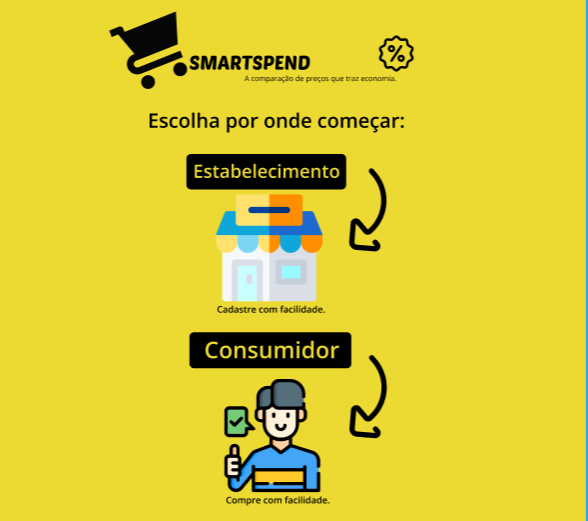
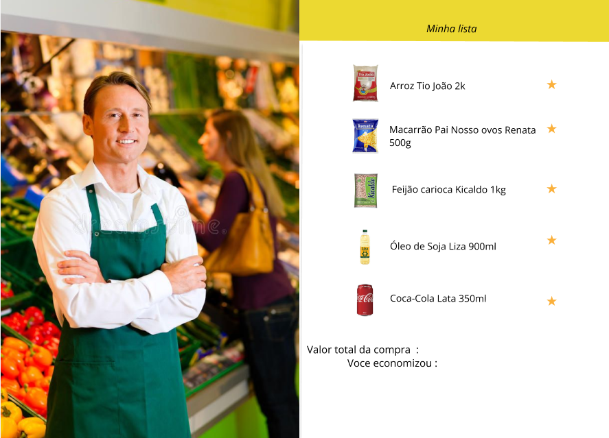
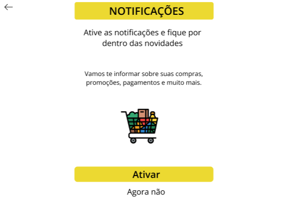
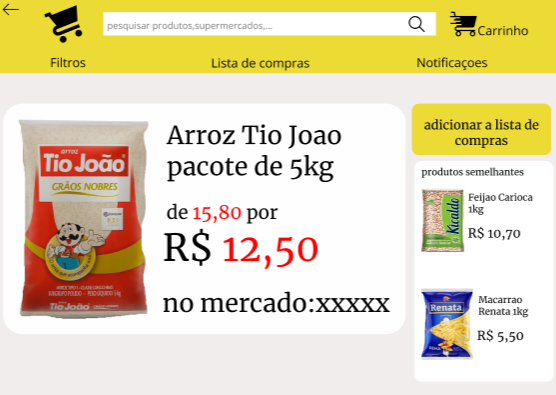

# Projeto de Interface

## User Flow

Fluxo de usuário (User Flow) é uma técnica que permite ao desenvolvedor mapear todo fluxo de navegação do usuário na aplicação. Essa técnica funciona para alinhar os caminhos e as possíveis ações que o usuário pode fazer junto com os membros de sua equipe.

acesse o <a href="https://www.figma.com/file/mMQ6xjD8z8HkEmKKonzp6p/prot%C3%B3tipo-SmartSpend?type=design&mode=design&t=GTBVOqb0ldmRynez-0">Ambiente Figma do Projeto</a>

## Protótipo

Desenvolver um protótipo emerge como uma das maneiras mais ágeis e econômicas de validar uma ideia, conceito ou funcionalidade. Isso permite a interação, avaliação, modificação e aprovação das principais características de uma interface antes de entrar na fase de desenvolvimento. Leia o artigo [Protótipos: baixa, média ou alta fidelidade?](https://medium.com/ladies-that-ux-br/prot%C3%B3tipos-baixa-m%C3%A9dia-ou-alta-fidelidade-71d897559135).

### Protótipo de baixa fidelidade

### Inicio

É aqui que a aplicaçao começa

### Pagina Inicial

na tela inicial,é apresentado as promoçoes nos mercados cadastrados,categorias de produtos,filtros de pesquisa e notificaçoes

### Lista de Compras

Nessa tela mostra a lista de produtos favoritados e o valor economizado pelo cliente.

### Tela de login

Nessa tela o usuario cria sua conta,ou faz login,sendo cliente ou dono de mercado

### Gestão de ofertas ###

Nessa tela o representante do supermercado gerência seus produtos.

>### Notificaçoes

Nessa tela o usuario ativa e desativa as notificaçoes da aplicaçao

### Produto

Nessa tela o usuario tem mais informaçoes sobre o produto selecionado

