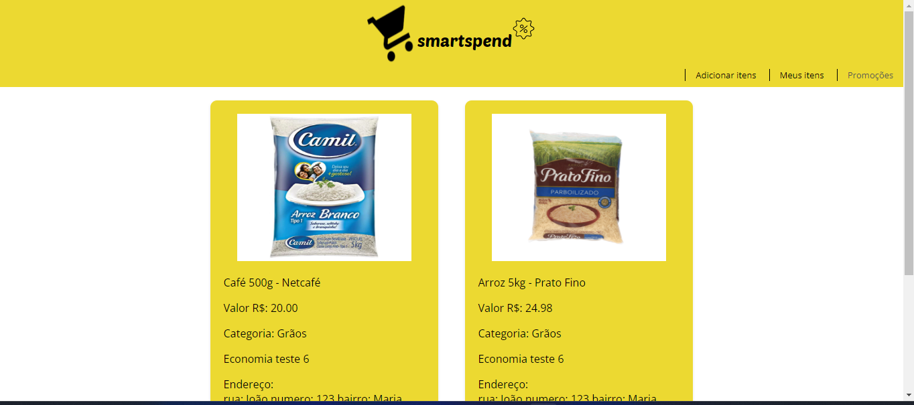

# Registro de Testes de Software

Relatório com as evidências dos testes de software realizados na aplicação pela equipe, baseado no plano de testes pré-definido.

Os resultados dos testes funcionais realizados na aplicação são descritos a seguir. [Utilize a estrutura abaixo para cada caso de teste executado]
 

|Caso de Teste    | CT-01 - Criar conta |
|:---|:---|
| Requisitos Associados | RF-09 |
| Objetivo do Teste | Criar uma conta |
| Passos | 1. preencha os campos do formulario, 2. clique em cadastrar |
| Critérios de êxito | se todos os dados estiverem corretos, a página deve ser direcionada para a página de login  |
| Resultados obtidos | usuário cadastrado e pagina redirecionada corretamente  |
| Responsável pela execução do caso de Teste | Patrick Breno |

 

 
 

|Caso de Teste    | CT-02 - adicinar item |
|:---|:---|
| Requisitos Associados | RF-10 |
| Objetivo do Teste | Cadastrar um item do supermercado |
| Passos | 1. preencha os campos do formulario, 2. clique em enviar |
| Critérios de êxito | item deverá ser exibido na tela "meus itens" ou "promoções"  |
| Resultados obtidos | item cadastrado e exibido corretamente  |
| Responsável pela execução do caso de Teste | Patrick Breno |

 

 

|Caso de Teste    | CT-03 - Buscar item |
|:---|:---|
| Requisitos Associados | RF-03    |
| Objetivo do Teste | Pesquisar no site pelo produto "arroz" |
| Passos | 1. digite o nome do item na barra de peaquisa, 2. clique buscar |
| Critérios de êxito | O resultado da busca deve ser de acordo com o que foi pesquisado  |
| Resultados obtidos | O resultado da busca foi de acordo com o pesquisado  |
| Responsável pela execução do caso de Teste | Patrick Breno |

 

 

|Caso de Teste    | CT-04 - Buscar item |
|:---|:---|
| Requisitos Associados | RF-5    |
| Objetivo do Teste | Adicionar um item a lista de compras |
| Passos | 1. clique no item desejado para exibir o item detalhado, 2. clique no botão "adicionar a lista" |
| Critérios de êxito | O item deverá ser exibido na lista de compras |
| Resultados obtidos | O item foi exibido na lista e compras corretamente  |
| Responsável pela execução do caso de Teste | Patrick Breno |

 

 
